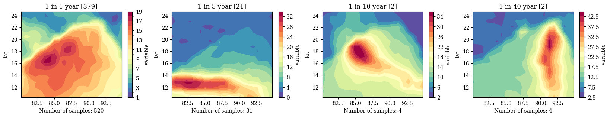

# Hazard GAN
Wasserstein GAN to generate multivariate windstorm footprints over the Bay of Bengal.

**In development**

## Installation
```bash
git clone git@github.com:alisonpeard/hazGAN.git
cd environments
mamba create -f mac-m1.yaml
mamba activate hazGAN
cd ..
python -m pip install -e .
```
