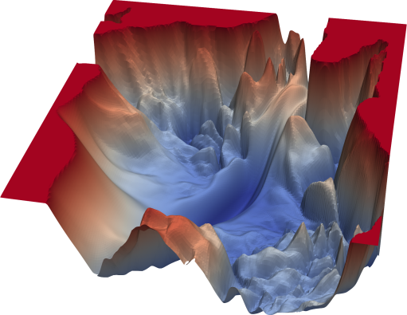

# Notes on loss landscapes
> "Neural networks seem to implicitly self-regularize, so the coefficients are penalized before they get too big" – Shruti

This,
* Reduces the justification for other regularization strategies, such as dropout
* Performs better across complex, non-convex loss lanscapes as shown below because they tend to find the smoothest path to the optimum, this leads to a smoother loss surface
* This also increases the network capability to generate good out-of-sample predictions.

Convex functions have only one, global minimum, rather than multiple local minima.
<figure>

<figcaption> https://efxa.org/2021/04/17/loss-function-convexity-and-gradient-descent-optimization/</figcaption>
</figure>

See also: https://arxiv.org/abs/1810.01075